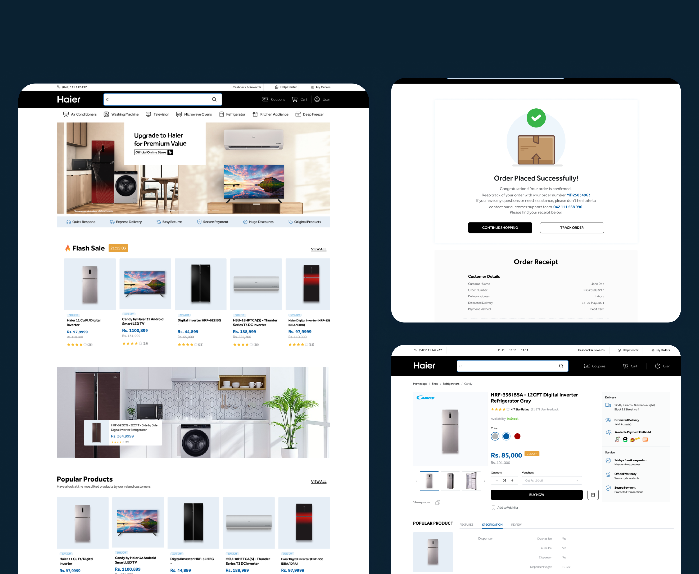

# HaierMall — E-Commerce Redesign

**A full UI/UX redesign of HaierMall.com — Pakistan's official Haier 
appliance e-commerce platform — resulting in a 25% increase in online 
sales within 3 months of launch.**

---

## Project overview

| | |
|---|---|
| **Client** | Haier Pakistan — HaierMall.com |
| **My role** | Lead UI/UX Designer — sole designer on the project |
| **Scope** | End-to-end redesign: audit → research → IA → design system → responsive UI → developer handoff |
| **Teams** | Business stakeholder · Product manager · 2 development teams (China + Pakistan) |
| **Tools** | Figma · FigJam · Baymard Institute research |
| **Status** | Phase 1 delivered and live · Phase 2 scoped |

---

## The hard constraint that defined everything

> **We were explicitly prohibited from changing any functionality in Phase 1.**

Every interaction, every backend flow, every data structure remained 
untouched. I could only change what the user *sees* — the visual language, 
the layout, the hierarchy, the brand expression, the component quality.

This turned the project into a focused design hypothesis:  
**How much conversion improvement can great design deliver, without 
touching a single line of functional code?**

The answer: **+25% online sales in 3 months.**

---

## The problem

HaierMall had spent 40 years building premium quality associations as 
a global brand. The website spent every pixel eroding them.

The original site was entirely black and white — no brand colours, no 
visual system, no identity. A consumer who knew Haier from retail would 
land on HaierMall and find nothing confirming they were on a world-leading 
premium brand's platform.

**5 audit findings:**

1. **Zero brand identity on the platform** — no Haier brand colours, 
   no visual system, no premium signals
2. **Navigation with no hierarchy** — all paths felt equal weight, 
   product discovery was failing early in the funnel
3. **Product pages buried purchase-confidence signals** — reviews 
   below the fold, weak CTA dominance, no trust hierarchy
4. **Checkout looked visually detached from the rest of the site** — 
   a trust-breaking pattern that Baymard's research directly links to 
   payment page abandonment
5. **Mobile experience was unoptimised** — below-spec tap targets, 
   product thumbnails too small for high-value appliance evaluation, 
   navigation requiring horizontal scroll

**The pivotal research insight:**  
Every problem traced to the same root — HaierMall's visual design was 
actively communicating the opposite of what Haier's brand represents. 
This was not a visual refresh problem. It was a **brand trust restoration 
problem.** And it was solvable entirely within Phase 1 — because trust 
is a design variable, not a functional one.

---

## Research approach

No access to analytics dashboards due to company data confidentiality 
policy. All performance data was relayed via the development team. My 
research was structured around three independent sources:

**1 — CRO and UX audit of the existing site**  
Structured heuristic review against Nielsen's 10 usability principles 
and e-commerce-specific conversion patterns.

**2 — Competitive analysis**  
Reviewed how premium appliance brands handled the same design challenges 
across five dimensions: navigation architecture, product page purchase 
hierarchy, checkout trust signal design, mobile layout quality, and 
brand identity end-to-end consistency.

**3 — Baymard Institute research**  
Used as the quantitative foundation in place of internal analytics. 
Key findings that directly shaped design priorities:

- 70% of shopping carts are abandoned before checkout completion
- The average e-commerce checkout has 23.48 form elements — research 
  recommends 12–14
- Fixing major checkout UX issues alone can increase conversions by 
  up to **35.26%**
- **17% of users abandon checkout because the site doesn't look 
  trustworthy** — a visual design problem, not a functional one

That last finding was the most important number in the project brief. 
For a brand selling Rs. 11,100–100,000+ appliances, visual trust is 
the primary conversion variable.

---

## Three directions considered — one chosen, two rejected

| Direction | Core idea | Decision |
|---|---|---|
| **A — Cosmetic rebrand only** | Apply Haier colours and typography to the existing layout exactly as-is | **Killed** — premium colours on a broken structure communicates broken |
| **B — Full navigation IA rebuild** | Redesign the entire information architecture and category taxonomy from scratch | **Deferred to Phase 2** — required backend data changes outside Phase 1 scope |
| **C — Design system led, layout optimised** | Build a rigorous design system from the Haier brand guide. Apply it to an optimised layout restructuring visual hierarchy, navigation weight, product pages, and checkout trust signals | **Chosen** — maximum visible impact within Phase 1 constraints |

---

## 6 design decisions — each a conversion decision

**1 — Brand colour system applied end-to-end**  
Haier brand red applied as the primary CTA colour, key navigational 
actions, and promotional signifiers — creating an unbroken visual 
identity thread from first impression through to order confirmation. 
Critical application: checkout pages, which previously looked completely 
disconnected from the rest of the site.

**2 — Mega menu with sticky header**  
Existing navigation links retained exactly (Phase 1 constraint). What 
changed: their visual architecture. Primary appliance categories given 
highest visual weight, sub-categories grouped and labelled, promotional 
links visually distinguished. Sticky header kept navigation accessible 
during long product page scrolls. Same links, transformed hierarchy.

**3 — Product pages rebuilt around the premium purchase decision sequence**  
Layout restructured to follow the established premium e-commerce 
decision hierarchy: hero imagery → price and key specs above fold → 
dominant CTA → featured reviews → detailed specifications → upsells. 
Reviews elevated from below specs to above them — based on Baymard's 
finding that 95% of users rely on reviews during product evaluation.

**4 — Checkout trust signal overhaul within existing flow logic**  
Could not change checkout steps or logic. Changed everything the user 
sees. Baymard enclosed field treatment for all form fields. Trust seals 
and security indicators above the payment input. Persistent order 
summary throughout checkout. Full brand system running unbroken through 
every checkout screen.

**5 — Mobile-first, WCAG 2.1 AA compliant component system**  
44px minimum tap targets throughout. Single-column dominant product 
grids for major appliances on mobile — 2-column grids produced 
thumbnails too small to evaluate product quality for large appliances. 
All colour contrast ratios verified against WCAG 2.1 AA. Every 
component state documented at handoff — focus, error, loading, empty.

**6 — 50+ component Figma system built for cross-cultural dev handoff**  
Simultaneous handoff to Chinese and Pakistani development teams required 
zero-ambiguity documentation. Consistent component naming taxonomy. 
All interactive states documented. Spacing specs in px and rem. Figma 
component properties system used to contain variant sprawl and make 
components self-documenting. Built to be extended by developers 
independently — no designer interpretation required at implementation.

---

## What testing changed

**Finding 1 — Flash sale placement moved from below-hero to persistent 
sub-header**  
Testing revealed time-sensitive pricing was the primary engagement hook 
for many users, but they were missing it by not scrolling past the hero. 
Moved to a visually distinct sub-header directly below main navigation.

**Finding 2 — Mobile product grid switched to single-column dominant 
for major appliances**  
Initial 2-column mobile grid produced thumbnails too small to evaluate 
product quality for large appliances. Single-column dominant card on 
mobile for refrigerators, washing machines, and air conditioners. 
2-column retained for small accessories.

**What I didn't fully validate:**  
Upsell and cross-sell placement on product detail pages. Designed based 
on competitive patterns and Baymard guidance — no A/B test of above vs 
below-fold placement variations. First test I would run in Phase 2.

---

## Outcomes — 3 months post-launch

| Metric | Result |
|---|---|
| Online sales | **+25%** |
| Product discovery speed | **+40% faster** (usability testing) |
| Bounce rate | **−20%** |
| Average session duration | **+15% longer** |

Every result was achieved under Phase 1 constraints — no new features, 
no checkout flow modifications, no search improvements, no personalisation. 
The entire lift came from visual design quality, layout architecture, 
brand system application, and component hierarchy.

Post-launch customer feedback cited **ease, clarity, and trustworthiness** 
as the primary improvements — mapping precisely to Baymard's three core 
drivers of e-commerce conversion confidence.

---

## Reflection

**What I'd do differently:**  
I underestimated the cross-team documentation burden. Component naming 
conventions that were intuitive to me created implementation ambiguity 
across the Chinese and Pakistani teams. I introduced a dedicated Figma 
annotation layer mid-project — interaction notes, state documentation, 
spacing callouts — that should have been part of the design system setup 
from day one. On any cross-cultural, cross-timezone project, documentation 
is a design deliverable.

**What Phase 2 must prioritise — in order:**  
1. Information architecture rebuild via user-tested card sorting  
2. Checkout flow redesign — target form field count, add guest checkout, 
   surface shipping costs earlier  
3. A/B testing of upsell placement on product detail pages  
4. Homepage personalisation — Haier's smart home and IoT ecosystem 
   story is currently untold at the digital purchase moment

---

---

## Figma source file

→ [Open in Figma](#https://www.figma.com/design/5TsYjxtEwc8BKGf34lGxGa/VD-Haier-Mall?node-id=1309-19635&t=JcC70YaOOM1CpQX1-1) 

---

*Designed by [Sana Ishaq](https://github.com/sanaishaq) · Lead UI/UX 
Designer · Ecommerce & SaaS*
